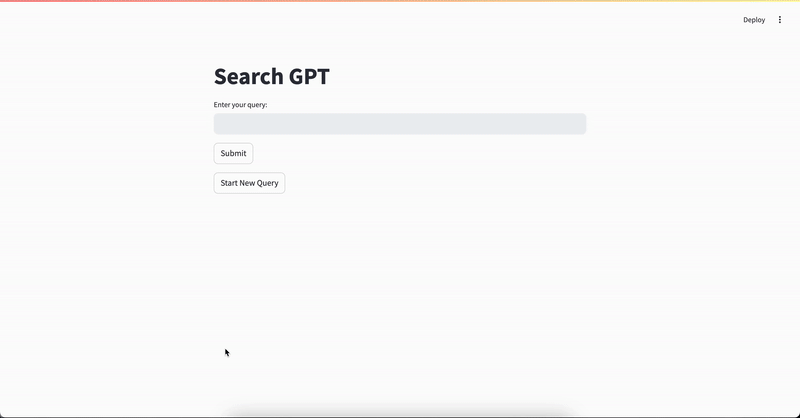

# Search-GPT by Dynamiq: A Scalable AI-Powered Search Application

Search-GPT is an advanced AI-powered search application designed to process and refine search queries, retrieve accurate and relevant information from the web, and present well-structured answers with source citations. It uses the Dynamiq framework to integrate and manage workflow steps, each enhancing the query process. This repository includes two backend implementations: a code-based solution (`server_via_dynamiq.py`) and a dynamic workflow-driven backend (`server.py`) with a Streamlit-based user interface (`app.py`).


---

## Table of Contents

- [Overview](#overview)
- [Features](#features)
- [Getting Started](#getting-started)
  - [Clone the Repository](#clone-the-repository)
  - [Set Up Environment Variables](#set-up-environment-variables)
  - [Install Requirements](#install-requirements)
  - [Run the Application](#run-the-application)
- [Using Docker](#using-docker)
  - [Build Docker Image](#build-docker-image)
  - [Run Docker Container](#run-docker-container)
- [Environment Variables](#environment-variables)
- [Project Structure](#project-structure)
- [How It Works](#how-it-works)
- [License](#license)
- [Contributing](#contributing)

---

## Overview

The Search-GPT application processes user queries in three stages:

1. **Rephrase**: Refines the query to improve search relevance.
2. **Search**: Retrieves relevant results from the web.
3. **Answer**: Synthesizes information from search results, providing a concise answer with source citations.

With two server implementations, Search-GPT offers flexibility in query processing:

- A streamlined, code-based backend (`server_via_dynamiq.py`)
- A workflow-oriented backend using Dynamiq nodes (`server.py`)

The frontend is built with Streamlit, making the application user-friendly and accessible through a web browser.


## Features

- **Dynamic Query Rephrasing**: Improves search relevance by rewriting queries for clarity and precision.
- **SERP Integration**: Fetches search results from Scale SERP, delivering relevant, real-time data.
- **Answer Synthesis with Citations**: Synthesizes responses from multiple sources, formatted with citations for credibility.
- **Modular Workflow**: Each query step is managed by individual Dynamiq nodes for enhanced flexibility.
- **Real-Time Streaming**: Streams answers chunk-by-chunk, providing a responsive user experience.
- **User-Friendly Interface**: Uses Streamlit for a simple, interactive user experience.
---

## Getting Started

### Clone the Repository

To start using the project, clone this repository:

```bash
git clone https://github.com/yourusername/search-gpt.git
cd search-gpt
```

### Set Up Environment Variables

1. Copy `.env-example` to `.env`:

   ```bash
   cp .env-example .env
   ```

2. Open `.env` and replace the placeholder values with your actual API keys and endpoint information.

### Install Requirements

Install dependencies with:

```bash
pip install -r requirements.txt
```

### Run the Application

Once dependencies are installed and environment variables are set up, you can start the application with:

```bash
streamlit run app.py
```

The application will be accessible at [http://localhost:8501](http://localhost:8501).

---

## Using Docker

### Build Docker Image

To build the Docker image, make sure you are in the project directory and run:

```bash
docker build -t search-gpt .
```

### Run Docker Container

Run the Docker container, ensuring it loads the `.env` file:

```bash
docker run --rm --env-file .env -p 8501:8501 search-gpt
```

This command:
- Uses `--env-file .env` to load environment variables from the `.env` file.
- Maps the container’s port `8501` to `8501` on the host machine.

The application will be accessible at [http://localhost:8501](http://localhost:8501).

---

## Environment Variables

To use this application, set the following environment variables in your `.env` file:

- `DYNAMIQ_ENDPOINT`: Your Dynamiq API endpoint.
- `DYNAMIQ_API_KEY`: API key for Dynamiq.
- `OPENAI_API_KEY`: API key for OpenAI.
- `SERP_API_KEY`: API key for the SERP tool.
- `PORT`: Port for the Streamlit application (default is `8501`).

---

## Project Structure

Here’s an overview of the main files in this repository:

- **`server.py`**: A dynamic workflow-driven backend using the Dynamiq framework for managing query processes.
- **`server_via_dynamiq.py`**: A streamlined, code-based backend for processing queries without a workflow setup.
- **`app.py`**: Streamlit-based frontend that interacts with the backend and provides a user interface for query inputs and outputs.
- **`requirements.txt`**: Specifies the required Python libraries, including `dynamiq` and `streamlit`.
- **`.env-example`**: Template file for environment variables, which can be copied to `.env`.

---

## How It Works

1. **Rephrase**: The input query is refined for clarity, relevance, and search optimization.
2. **Search**: The rephrased query is sent to the SERP API to fetch relevant search results.
3. **Answer Synthesis**: Information from search results is processed to produce a concise answer with sources. 

Each stage operates within a Dynamiq node (in `server.py`), making the system modular and adaptable for future enhancements. In `server_via_dynamiq.py`, the same process occurs without the workflow infrastructure, simplifying the backend.

---

## License

This project is licensed under the MIT License. See the [LICENSE](LICENSE) file for details.

---

## Contributing

Contributions are welcome! Please read the [CONTRIBUTING.md](CONTRIBUTING.md) file for guidelines on how to contribute.
